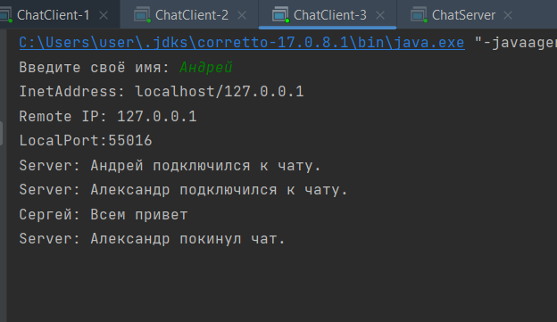

**Реализация клиент-серверного приложения с возможностью отправлять личные сообщения через символ @ (@ник)**

Клиенты 1 и 2 отправили друг другу сообщения через символ "@"

При этом клиент 3 не видит данных сообщений

